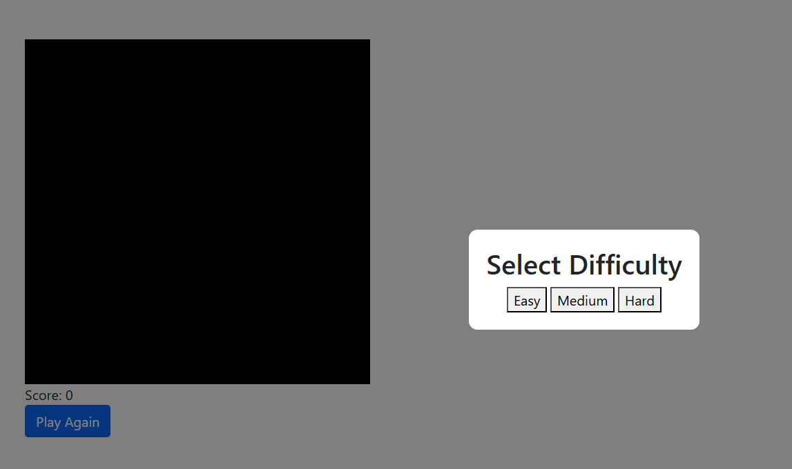
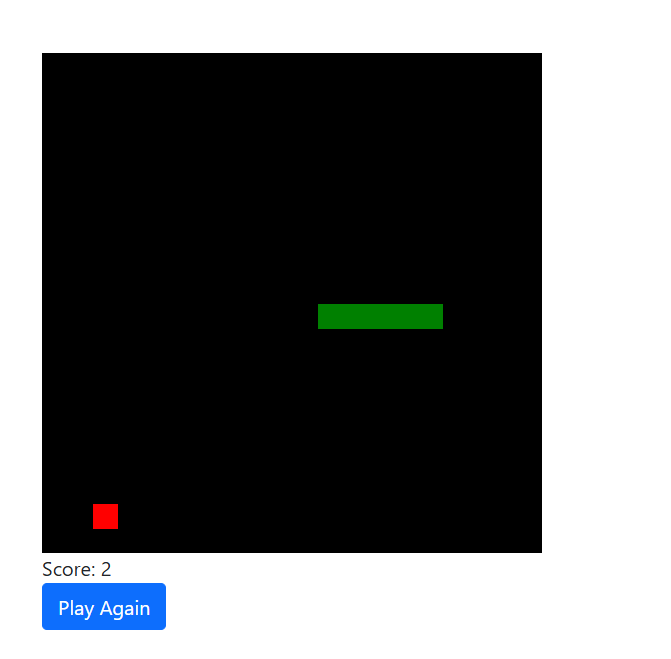

# 🐍 Snake Game

A simple yet fun **Snake Game** built with HTML, CSS, and JavaScript. It includes a difficulty selection feature, allowing players to choose from **Easy, Medium, and Hard** levels.

## 🚀 Features

- 🎮 **Classic Snake Game** with smooth movement
- 🎯 **Difficulty Levels**: Easy, Medium, and Hard
- 🍎 **Food Generation**: The snake grows when it eats food
- 🏆 **Score Tracking**: Displays the player's current score
- 🎨 **Minimalist UI** with Bootstrap integration

## 📸 Screenshot




## 🛠️ Technologies Used

- HTML5  
- CSS3  
- JavaScript  
- Bootstrap 5  

## 🎮 How to Play?

1. **Choose a difficulty level** (Easy, Medium, or Hard).
2. Use the **Arrow Keys** to control the snake:
   - ⬆️ Up
   - ⬇️ Down
   - ⬅️ Left
   - ➡️ Right
3. **Eat the red food** to grow and increase your score.
4. Avoid **colliding** with the walls or yourself.
5. The game ends when you hit a wall or yourself.

## 🖥️ Setup Instructions

1. Clone this repository:
   ```sh
   git clone https://github.com/divyansh150506/snake-game.git
